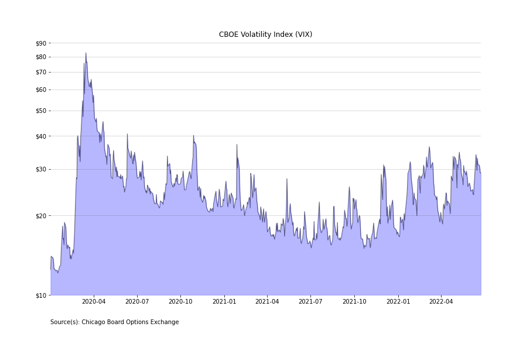
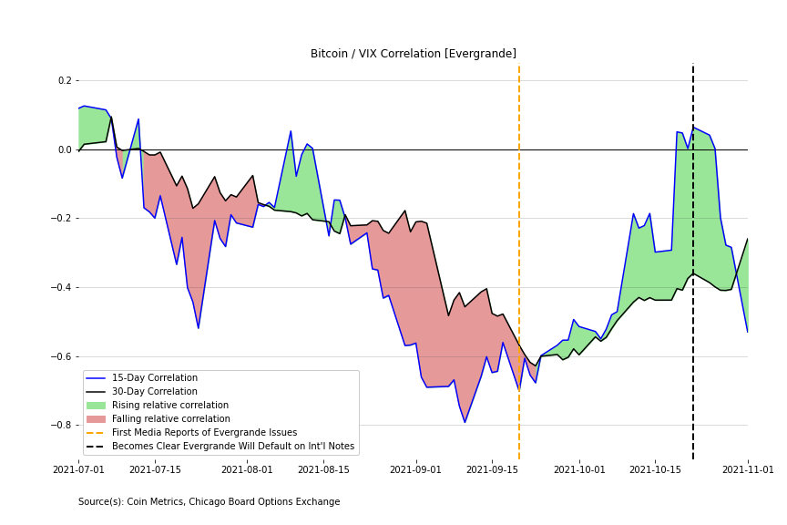

# Long Volatility

This script pulls historic price data for bitcoin and ethereum from the CoinMetrics API and then historic VIX data from the Chicago Board of Options Exchange and looks at the correlation between bitcoin and the volatility index to look at how Bitcoin has reacted during times of global panic. In-depth commentary is available at the link below:

https://dataalways.substack.com/p/is-bitcoin-long-volatility

Volatility Index: 

Bitcoin reaction to Evergrande defaults:

